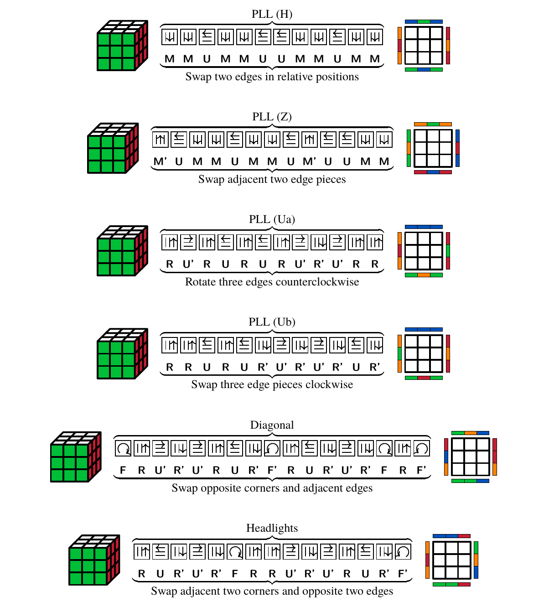
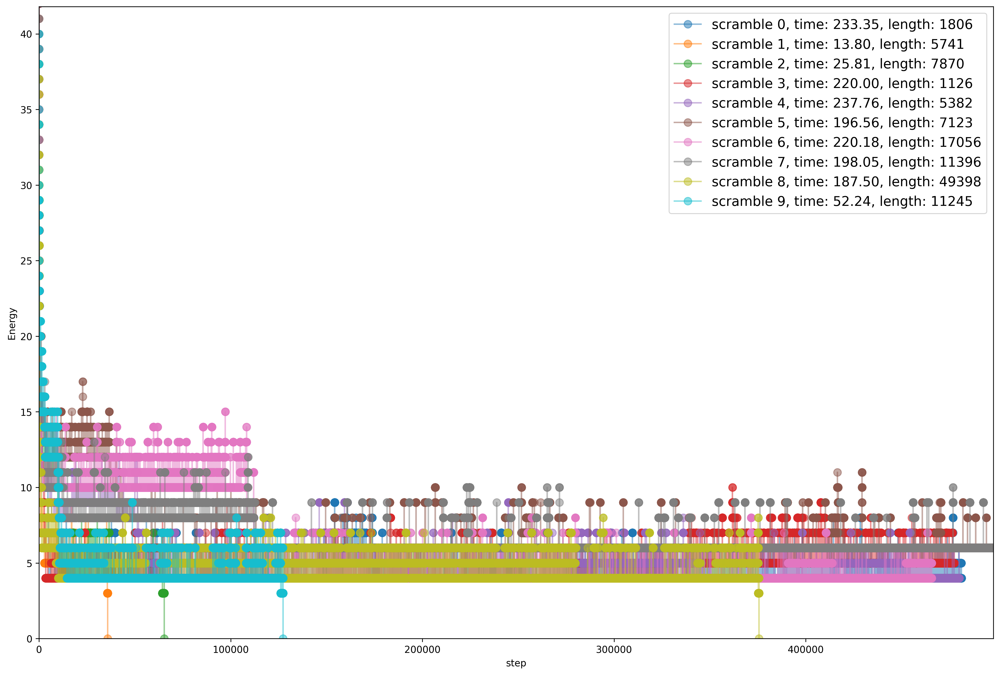

#

*Read this in other languages: [English](README.zh-en.md).*

## 使用方法

pip install simanneal

python3 src/cube_solver.py

## 问题描述

魔方, 是厄尔诺·鲁比克(Ernő Rubik)于1974年发明的机械智力玩具,
相关的变体和异形层出不穷, 风靡程度经久未衰.

标准的三阶魔方(Rubik's Cube)的还原是扭转谜题中的一个最具代表的智力游戏.
魔方的六个面具有不同的颜色且都可以分别转动,
其还原状态指其每个面上的九个色块都相同的情况, 而其他则属于被打乱的状态.
将一个打乱的魔方进行还原为目标, 衍生出了速拧, 盲拧, 最少步等内容,
每年都会有各种[大小赛事](https://www.worldcubeassociation.org/)以此竞技.

对于标准三阶魔方, 下面给出了基于模拟退火的魔方还原算法.
具体地, 根据魔方的基本组成给出了魔方状态的能量函数, 并通过群论中的共轭和交换子生成适合的领域解.
基于模拟退火框架得到了魔方还原所需要的步骤解法.

这种算法对于大部分类似的扭转谜题具有通用性, 且实现便捷,
最终的实验结果表明其能在0.5至10秒间求解魔方, 步数控制在500-1000步间.

## 算法设计与分析

### 模拟退火算法框架

模拟退火(Simulated annealing, 缩写作SA)是一种通用概率算法,
常用来在一定时间内寻找在一个很大搜寻空间中的近似最优解.
模拟退火在1983年为S. Kirkpatrick, C. D. Gelatt和M. P. Vecchi所发明, V.
Černý也在1985年独立发明此算法.

以下是本文所使用的标准模拟退火算法框架的伪代码.

**$Simulated\_annealing(State, steps, T_{max}, T_{min})$:**

**输入:** 被打乱的魔方的状态: `State`. 迭代次数: `steps`, 最高温度: `T_max`, 最低温度: `T_min`

**输出:** 模拟退火求解后魔方的最好状态以及相应能量: `(bestState, bestEnergy)`

1. 初始化 $T\gets T_{max}$
2. $E\gets$ `Energy(State)` （定义见下）
3. $prevState \gets State,\ prevEnergy \gets E$
4. $bestState \gets State,\ bestEnergy \gets E$
5. $step \gets 0$
6. 当 $step < steps \text{ and } E \neq 0$ 时, 执行以下操作（若 $E=0$ 表示魔方已还原）
    1. $State\gets$ `Neighbour(State)` （定义见下）
    2. $E\gets$ `Energy(State)`
    3. $\Delta E\gets E-prevEnergy$
    4. 如果 $\Delta E > 0$ 且 $e^{-\Delta E / T} < $ `RANDOM(0,1)`, 则执行以下操作
        - $State \gets prevState,\ E \gets prevEnergy$
    5. 否则, 执行以下操作
        - $prevState \gets State,\ prevEnergy \gets E$
        - 如果 $E < bestEnergy$, 则执行以下操作
            - $bestState \gets State,\ bestEnergy \gets E$
    6. $T\gets$ `Cooling(T, T_max, T_min, step, steps)`（定义见下）
    7. $step \gets step+1$
7. $State \gets bestState$
8. 返回 `(bestState, bestEnergy)`

**$Cooling(T,\ T_{max} ,\ T_{min} ,\ step,\ steps)$:**

**输入:**  $T,\ T_{max} ,\ T_{min} ,\ step,\ steps$

**输出:** $T$

1. $T_{factor} \gets -\log(T_{max} / T_{min})$
1. $T \gets T_{max} \times e^{T_{factor} \times step / steps}$
1. 返回 $T$

### 魔方状态的度量与能量

我们将衡量被打乱的魔方到其还原态的距离度量, 来作为魔方状态的能量目标函数.
显然如果魔方状态间距离为0, 那么便可以认为两个魔方的状态相同.

为了达到魔方还原的目标, 需要优化能量目标函数至全局最优值 0.

**Energy(State):**

**Input:** 魔方状态 `State`

**Output:** 魔方对应状态的能量 `E`

1. 将 `E` 设为 0。
2. 对于魔方的每个面 `Face`, 循环执行以下操作：
   - 对于魔方的每个色块 `sticker`, 循环执行以下操作：
     - 如果 `sticker` 的颜色与 `Face` 的中心块不同, 将 `E` 值加 1。
3. 返回 `E`。

### 领域解的生成

关于魔方状态的领域解的生成 **$Neighbour(State)$**,
主要了参考魔方速解Fridrich/CFOP方法中的第四个步骤 PLL(Permutation of the Last Layer), 并从中选择变换公式作为改变魔方状态的基本操作.
这些公式主要是用来还原魔方顶层的块的位置, 不会影响到其他层的色块, 每个公式都可以看作是对魔方状态的一个较小的扰动.

#### 2 Look PLL

完整的PLL公式共二十一条, 采用以下六个公式代替魔方的六个基本转动, 用以生成领域解.
这些公式也被称作为2 Look PLL, 意为理论上可以只通过两次公式便把魔方角块与棱块所对应的排列对齐.

<figure id="fig:0">

<figcaption>2 Look PLL</figcaption>
</figure>

不采用魔方的6个基本转动来生成魔方的领域解, 这是因为每次转动都会影响到魔方超过20%的色块, 对本文所设计的能量函数扰动太大.
同样的,在这里也并不引入CFOP方法的其他包括OLL(Orientation of the Last Layer)的公式,
还原魔方某一层的角块或棱块的方向并不会显著降低下降魔方状态的能量 $E$,
反而会改变较多色块的位置导致过大增加扰动幅度, 经过测试基本操作仅使用OLL公式效果或许更好.

### 使用共轭和交换子进行改良

以上初步设计了一种基于模拟退火的魔方还原算法.
虽然对于部分打乱的魔方能够在有限时间内得到解法, 但是还原步骤复杂且需要较多迭代次数.
最致命的是, 仅依赖2 Look PLL生成的领域解容易陷入局部最优解(即仅差几个色块的还原而导致失败).

为了提高算法效率, 增加达到全局最优解的概率, 以及尽可能的减少步数,
我们针对魔方这类扭转谜题从群论的角度出发进行改进.

**Definition**
若有置换 $\mathbf{X},\mathbf{Y} \in$ 魔方群 $(G,·)$, 定义共轭 $\mathbf{X}^{\mathbf{Y}}$ 和交换子 $[\mathbf{X}, \mathbf{Y}]$

$$
[\mathbf{Y}: \mathbf{X}] = \mathbf{X}^{\mathbf{Y}} = \mathbf{Y} \mathbf{X} \mathbf{Y}^{\prime} \\
[\mathbf{X}, \mathbf{Y}] = \mathbf{X} \mathbf{Y} \mathbf{X}^{\prime} \mathbf{X}^{\prime}
$$

#### 对领域解生成的改良

若 $\mathbf{f}$ 是m-轮换,
即 $\mathbf{f}=\left(a_{1}, a_{2}, \ldots, a_{m}\right)$,
其中 $a_{i},\ i \in \{1,2,\ldots,m\}$ 为魔方的色块,
对于魔方群中的一个置换 $\sigma$, 有

$$\mathbf{f}^{\sigma}=\left(a_{1} \sigma^{\prime}, a_{2} \sigma^{\prime}, \ldots, a_{k} \sigma^{\prime}\right)$$

上述定理表明, 称为魔方技巧中所谓的预置(setup)操作本质上就是共轭.
PLL公式只是针对某一层的操作, 对于不在同一层的角块或是棱块,
我们可以先把魔方变换到可以运用符合要求的情况,
并再逆变换(undo-setup)抵消之前的预置。这并不会破坏置换的循环结构.

由此, 我们生成领域解不仅仅随机从2 Look PLL中选取公式 $Y$,
于此同时前后随机取 $X \in \mathbf{F},\ \mathbf{B},\ \mathbf{L},\ \mathbf{R},\ \mathbf{U},\ \mathbf{D}$,
将 $XY'X$ 作用在魔方上生成领域解.

**$Neighbour(State)$**

1. 随机选择 2 Look PLL 中的置换 Y
1. 随机选择复合基本转动 X ∈ {F, B, L, R, U, D, ø}²
1. 随机选择旋转 O ∈ {x, y, z, x', y', z', ø}

1. 输出 (State)OXY'X'

#### 通过交换子创造公式生成领域解

**Definition**
定义 $\mathbf{f} = (\mathbf{X_1},\ \mathbf{X_2},\ldots,\ \mathbf{X_n})$ 为一置换,
其中 $\mathbf{X_1},\ \mathbf{X_2},\ldots,\ \mathbf{X_n} \in \{\mathbf{F},\ \mathbf{B},\ \mathbf{L},\ \mathbf{R},\ \mathbf{U},\ \mathbf{D}\}$,
定义以下集合为置换 $\mathbf{f}$ 的支撑,
以表示那些可以被 $\mathbf{f}$ 改变的色块组成的集合.
$$\operatorname{supp}(\mathbf{f})=\{x \mid x \mathbf{f} \neq x\}$$

**Proposition**
若 $\mathbf{f}$和$\mathbf{g}$ 为属于魔方群的置换, 且
$\operatorname{supp}(\mathbf{f}) \cap \operatorname{supp}(\mathbf{g})=\emptyset$,
那么有 $\mathbf{f} \mathbf{g}=\mathbf{g} \mathbf{f}$. 若 $\mathbf{f}$ 与
$\mathbf{g}$ 可交换, 那么
$[\mathbf{f}, \mathbf{g}]=\mathbf{f} \mathbf{g} \mathbf{f}^{\prime} \mathbf{g}^{\prime}=\mathbf{I}$,
其中 $\mathbf{I}$ 表示恒等变换, 即什么都不做.

**Remark**
当两个置换的支撑不相交时, 它们的交换子实际上不改变任何色块,
也就是一个恒等操作;
交换子实际上是对两个操作的可交换性的一种度量。可以猜想,
如果两个置换操作的支撑相交很少, 那么它们的可交换性比较强,
也就是说交换子不会影响很多色块. 于是我们不加证明地给出以下两个重要定理.

**Theorem**
若 $|\operatorname{supp}(X) \cap \operatorname{supp}(Y)|=1$, 那么
$[X, Y]$ 为三轮换(3-cycles)

**Remark**
这代表由交换子构造公式以对魔方状态进行较小的扰动是相对容易的.

**Definition**
$\text { 若群 } G$ 作用在集合 $\Omega$ 且 $X \subseteq \Omega$, 定义

$$
\begin{aligned}
    \text{ 称 }\ \mathbf{g}\text{ 逐点固定 }X & ,\ \forall x \in X,\ \text{ 若 } x\mathbf{g} = x,\ \text{ 有 } X \subseteq \operatorname{fix}(\mathbf{g}) \\
    \operatorname{stab}(X)               & =\{\mathbf{g} \in G \mid X \mathbf{g}=X\}                                                              \\
    X^{C}                                & =\{x \in \Omega \mid x \notin X\}
\end{aligned}
$$

**Theorem**
若 $\mathbf{f} \in \operatorname{stab}(X)$ 且 $\mathbf{g} \text { 逐点固定 } X^{C}$,
那么 $[\mathbf{f}, \mathbf{g}] \text { 也逐点固定 } X^{C}$.

即如果 $X$ 是魔方的最后一层, 我们可以构造两个操作, 其中一个只旋转 $X$,
另一个操作分别影响顶层 $X$ 和其他两层中的色块,
但不会出现顶层与其他两层色块互换的情况.
此时这两个操作的交换子只改变顶层色块, 且有规律可循.
这给了我们代替PLL生成还原最后一步的公式提供了理论基础.

因此通过以上两个定理,
我们可以仅仅依赖交换子自动生成解魔方这类扭转谜题的领域解.

## 结果解释与讨论

### 参数设计

本文实验参数设计: 初始温度与最低温度分别为
$T_{max} = 0.37,\ T^{min} = 0.355$, 最大迭代步数为 $steps = 500000$.

考虑到魔方还原问题和领域解生成方式的特殊性,
我们实验设计的初始温度并非特别高,
这保证了在能够充分遍历随机生成的领域解的同时,
给予足够的扰动以跳出局部最优解.
另外, 魔方状态的能量函数是离散的,
每次迭代若 $\Delta E = 0$ 时, 由 $e^{-\Delta E / T} = 1 > random()$,
必将接受解. 此时虽然状态并未明显改变, 但会显著增加还原魔方的步数解,
为此本文对模拟退火算法中的条件转移函数做了细微的变化,
即若 $\Delta E = 0$, 特殊视作为 $1$.

### 实验结果

我们使用[puzzle scramble
generator](https://ruwix.com/puzzle-scramble-generator/?type=rubiks-cube)自动生成十个打乱的魔方,
通过以上基于模拟退火的算法进行还原. 最终的还原所需时间 $time$,
还原所需步骤 $length$,
以及对应每次迭代 $step$ 的能量 $Energy$ 变化如下图所示.

#### 仅使用2 Look PLL

10个打乱的魔方只有其中4个得到了还原, 其中解法步骤在5000步到50000步不等,
效果不佳.

<figure id="fig:0">

<figcaption>魔方状态的能量<em>Energy</em>变化图</figcaption>
</figure>

#### 通过共轭改进领域解

我们采用  作为 **$Neighbour(State)$**. 由下列实验结果,
通过共轭改进的模拟退火魔方还原算法效率得到了显著提升,
能在0.5至10s内生成魔方的还原步骤, 步骤长度在500到2000步内不等,
通过大量实验验证, 本文的算法得到还原解法的概率接近100%.

<figure id="fig:1">

<figcaption>魔方状态的能量<em>Energy</em>变化图</figcaption>
</figure>

#### 通过交换子生成领域解方法

由于时间因素, 抛弃使用人工设计公式,
通过交换子机器自动生成领域解方法暂未成熟, 在效率和成功率上只比仅使用2
Look PLL方法好一些, 10个被打乱的魔方中有6个得到了还原.
但这也是足以令人惊喜的结果了.
下面给出本文通过交换子生成领域解方法算法的大致思路. 其中随机的选取,
参数的设置等细节被舍去, 集合相乘使用笛卡尔积, 取逆作用于集合内所有元素.

**$Neighbour(State)$**
输入: 魔方状态State
输出: 魔方状态State, 并记录f

1. 复合基本转动X = {F,B,L,R,U,D,φ}^3
2. 预置操作集合S = {F,B,L,R,U,D,φ}^2
3. 共轭操作集合 Z ← SXS'
4. 交换子操作集合 C ← XXX'X'
5. 二阶交换子操作集合 C1 ← CCC'C', C2 ← CSC'S'
6. Return (State)f，其中f ∈ SC1S' 或 SC2S'

<figure id="fig:3">

<figcaption>魔方状态的能量<em>Energy</em>变化图</figcaption>
</figure>
