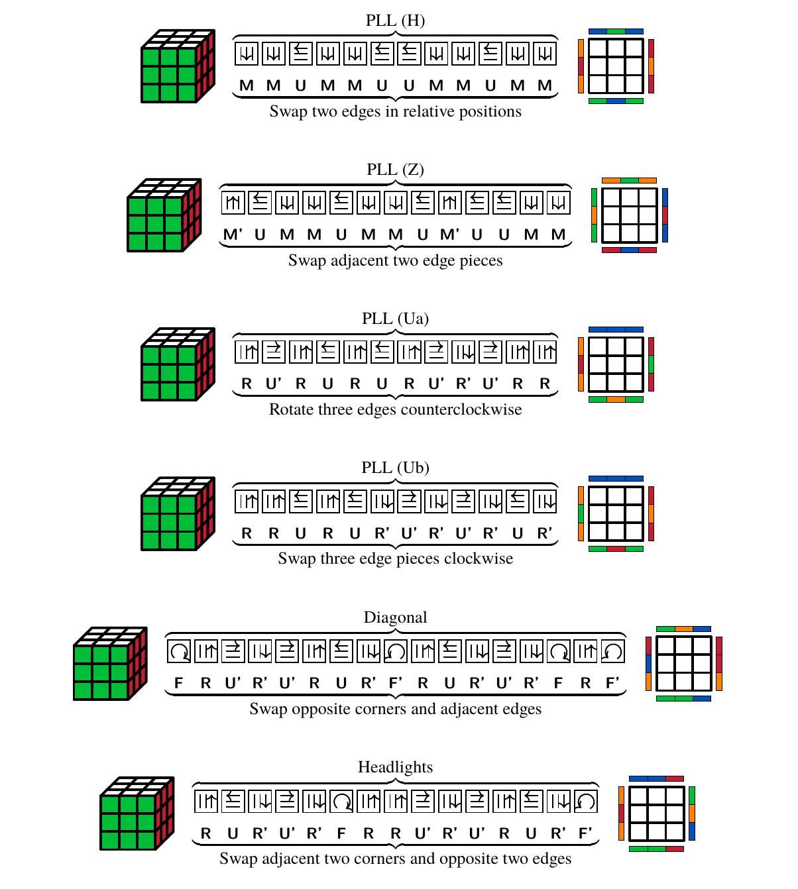
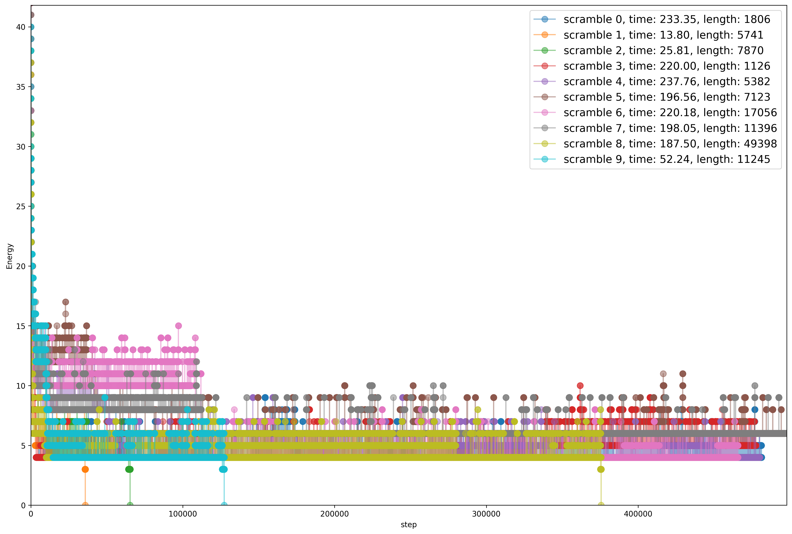
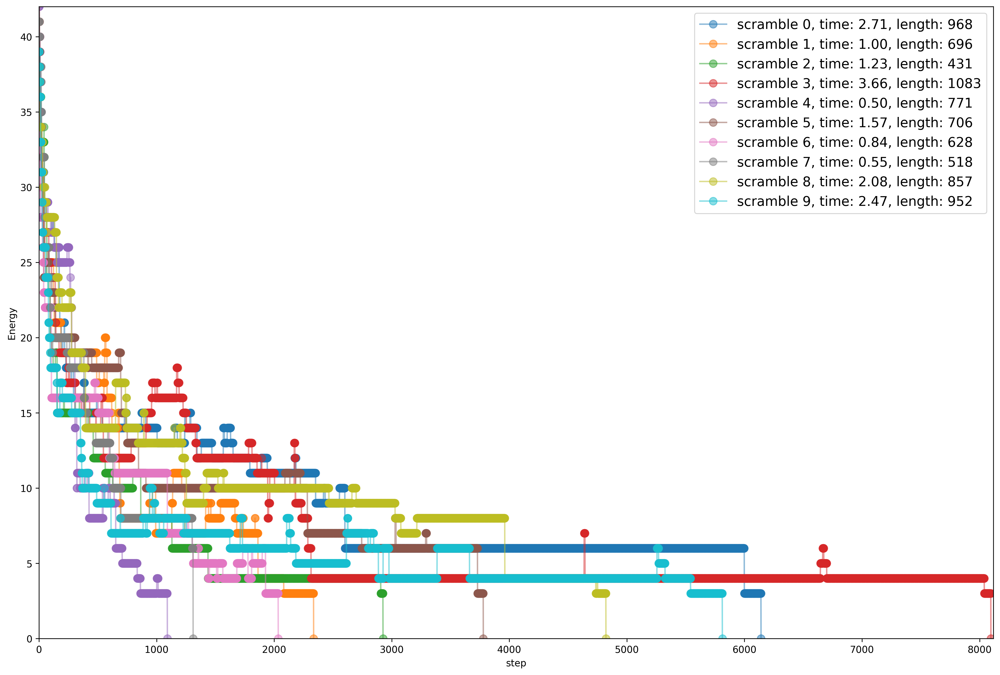
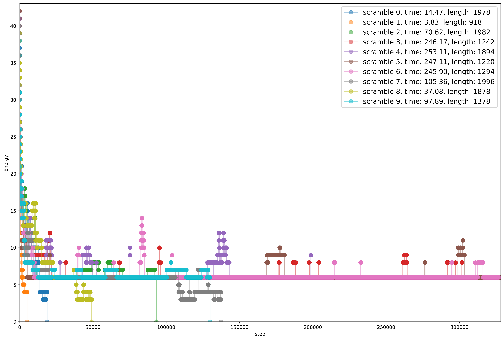

# <!-- Translated by ChatGPT -->

*Read this in other languages: [简体中文](README.md).*

## Usage

pip install simanneal

python3 src/cube_solver.py

## Problem Description

The Rubik’s Cube is a mechanical puzzle toy invented by Ernő Rubik in 1974. Its variants and shape-shifting puzzles are numerous and its popularity has not waned over time.

The restoration of the standard 3x3 Rubik’s Cube is one of the most representative intellectual games in twisty puzzles. The six sides of the cube have different colors and can be rotated independently. The restored state refers to the situation where all nine color blocks on each side are the same, while others belong to a scrambled state. The goal is to restore a scrambled cube, which has derived content such as speedcubing, blindfolded solving, and fewest moves. Various competitions of different sizes are held every year for this sport World Cube Association. It can be said that the Rubik’s Cube is currently one of the most popular intellectual games.

For the standard 3x3 Rubik’s Cube, we present a simulated annealing-based cube restoration algorithm. Specifically, based on the basic composition of the cube, an energy function for the cube state is given and suitable neighborhood solutions are generated through conjugation and commutators in group theory. Based on the simulated annealing framework, we obtain a step-by-step solution for restoring the cube.

This algorithm has generality for most similar twisty puzzles and is easy to implement. The final experimental results show that it can solve cubes within 0.5 to 10 seconds with steps controlled between 500-1000.

## Algorithm Design and Analysis

### Simulated Annealing Algorithm Framework

Simulated annealing (SA) is a general probabilistic algorithm commonly used to find an approximate optimal solution within a large search space in a certain amount of time. Simulated annealing was invented in 1983 by S. Kirkpatrick, C. D. Gelatt and M. P. Vecchi, and V. Černý independently invented this algorithm in 1985.

Below is the pseudocode for the standard simulated annealing algorithm framework used in this article.

**$Simulated\_annealing(State, steps, T_{max}, T_{min})$:**

**Input:** Scrambled cube state: `State`. Number of iterations: `steps`, Maximum temperature: `T_max`, Minimum temperature: `T_min`

**Output:** The best state of the cube after simulated annealing and its corresponding energy: `(bestState, bestEnergy)`

1. Initialize $T\gets T_{max}$
2. $E\gets$ `Energy(State)` （definition below）
3. $prevState \gets State,\ prevEnergy \gets E$
4. $bestState \gets State,\ bestEnergy \gets E$
5. $step \gets 0$
6. While $step < steps \text{ and } E \neq 0$ , perform the following operations (if $E=0$, it means that the cube has been restored)
    1. $State\gets$ `Neighbour(State)` （definition below）
    2. $E\gets$ `Energy(State)`
    3. $\Delta E\gets E-prevEnergy$
    4. If $\Delta E > 0$ and $e^{-\Delta E / T} < $ `RANDOM(0,1)`, then perform the following operations
        - $State \gets prevState,\ E \gets prevEnergy$
    5. Otherwise, perform the following operations
        - $prevState \gets State,\ prevEnergy \gets E$
        - If $E < bestEnergy$, then perform the following operations
            - $bestState \gets State,\ bestEnergy \gets E$
    6. $T\gets$ `Cooling(T, T_max, T_min, step, steps)`（definition below）
    7. $step \gets step+1$
7. $State \gets bestState$
8. Return `(bestState, bestEnergy)`

**$Cooling(T,\ T_{max} ,\ T_{min} ,\ step,\ steps)$:**

**输入:**  $T,\ T_{max} ,\ T_{min} ,\ step,\ steps$

**输出:** $T$

1. $T_{factor} \gets -\log(T_{max} / T_{min})$
1. $T \gets T_{max} \times e^{T_{factor} \times step / steps}$
1. Return $T$

### Measurement and Energy of Rubik’s Cube State

We will measure the distance between a scrambled Rubik’s Cube and its solved state as the energy objective function for the state of the Rubik’s Cube. Obviously, if the distance between two states of the Rubik’s Cube is 0, then it can be considered that the two states are identical.

In order to achieve the goal of restoring the Rubik’s Cube, it is necessary to optimize the energy objective function to reach a global minimum value of 0.

**Energy(State):**

**Input:** The state of the Rubik’s Cube `State`

**Output:** The energy corresponding to the state of the Rubik’s Cube `E`

1. Set `E` to 0.
2. For each `Face` of the Rubik’s Cube, perform the following operations in a loop:
   - For each `sticker` on this face, perform the following operations in a loop:
     - If the color of `sticker` is different from that of `Face`’s center block, add 1 to `E`.
3. Return `E`.

### Generation of Neighboring Solutions

Regarding **$Neighbour(State)$**, which generates neighboring solutions for states of Rubik’s Cubes, we mainly refer to step four (PLL) in Fridrich/CFOP method for solving Rubik’s Cubes quickly and choose transformation formulas from it as basic operations for changing states of Rubik’s Cubes. These formulas are mainly used to restore positions of blocks on top layer without affecting stickers on other layers. Each formula can be regarded as a small perturbation to state of Rubik’s Cube.

#### 2 Look PLL

There are a total of twenty-one complete PLL formulas. The following six formulas are used to replace the six basic rotations of the Rubik’s Cube to generate neighboring solutions. These formulas are also known as 2 Look PLL, which means that theoretically it is possible to align the permutation of corner blocks and edge blocks on the Rubik’s Cube with only two formulas.

<figure id="fig:0">

<figcaption>2 Look PLL</figcaption>
</figure>

The six basic rotations of the Rubik’s Cube are not used to generate neighboring solutions for the Rubik’s Cube because each rotation affects more than 20% of the stickers on the Rubik’s Cube and causes too much perturbation to the energy function designed in this article. Similarly, other formulas including OLL (Orientation of the Last Layer) from CFOP method are not introduced here. Restoring the direction of corner blocks or edge blocks on a certain layer of the Rubik’s Cube does not significantly reduce the energy $E$ of lowering the state of the Rubik’s Cube. Instead, it changes positions of many stickers and causes excessive increase in perturbation amplitude. After testing, it may be better to use only OLL formulas for basic operations.

### Improvement Using Conjugates and Commutators

We have initially designed a Rubik’s Cube restoration algorithm based on simulated annealing. Although solutions can be obtained within a limited time for some scrambled Rubik’s Cubes, restoration steps are complex and require many iterations. The most fatal thing is that neighboring solutions generated solely by 2 Look PLL are prone to fall into local optimal solutions (i.e., failure due to only a few stickers being restored).

In order to improve algorithm efficiency, increase probability of reaching global optimal solution and minimize number of steps as much as possible, we start from group theory perspective to improve twist puzzles like Rubik’s Cube.

**Definition**
If there are permutations $\mathbf{X},\mathbf{Y} \in$ Rubik’s Cube group $(G,·)$, define conjugate $\mathbf{X}^{\mathbf{Y}}$ and commutator $[\mathbf{X}, \mathbf{Y}]$.

$$
[\mathbf{Y}: \mathbf{X}] = \mathbf{X}^{\mathbf{Y}} = \mathbf{Y} \mathbf{X} \mathbf{Y}^{\prime} \\
[\mathbf{X}, \mathbf{Y}] = \mathbf{X} \mathbf{Y} \mathbf{X}^{\prime} \mathbf{X}^{\prime}
$$

#### Improvement on generation of neighboring solutions

If $\mathbf{f}$ is an m-cycle, i.e., $\mathbf{f}=\left(a_{1}, a_{2}, \ldots, a_{m}\right)$ where $a_{i},\ i \in {1,2,\ldots,m}$ are stickers on Rubik’s Cube. For a permutation $\sigma$ in Rubik’s Cube group, we have

$$\mathbf{f}^{\sigma}=\left(a_{1} \sigma^{\prime}, a_{2} \sigma^{\prime}, \ldots, a_{k} \sigma^{\prime}\right)$$

The above theorem shows that what is called setup operation in Rubik’s Cube techniques is essentially conjugation. PLL formulas are only for operations on a certain layer. For corner blocks or edge blocks that are not on the same layer, we can first transform the Rubik’s Cube to meet required conditions and then reverse transformation (undo-setup) to cancel previous setup. This will not destroy cyclic structure of permutation.

Therefore, when generating neighboring solutions, we not only randomly select formula $Y$ from 2 Look PLL but also randomly take $X \in \mathbf{F},\ \mathbf{B},\ \mathbf{L},\ \mathbf{R},\ \mathbf{U},\ \mathbf{D}$ before and after it and apply $XY’X$ to Rubik’s Cube to generate neighboring solutions.

**$Neighbour(State)$**

1. Randomly select permutation Y from 2 Look PLL
1. Randomly select composite basic rotation X ∈ {F, B, L, R, U, D, ø}²
1. Randomly select rotation O ∈ {x, y, z, x', y', z', ø}
1. Output (State)OXY'X'

#### Generating domain solutions through commutators

**Definition**
Define $\mathbf{f} = (\mathbf{X_1},\ \mathbf{X_2},\ldots,\ \mathbf{X_n})$ as a permutation, where $\mathbf{X_1},\ \mathbf{X_2},\ldots,\ \mathbf{X_n} \in {\mathbf{F},\ \mathbf{B},\ \mathbf{L},\ \mathbf{R},\ \mathbf{U},\ \mathbf{D}}$, define the following set as the support of permutation $\mathbf{f}$, to represent the set of blocks that can be changed by $\mathbf{f}$.

$$\operatorname{supp}(\mathbf{f})={x \mid x \mathbf{f} \neq x}$$

**Proposition**
Proposition If $\mathbf {f}$ and $\mathbb {g}$ are permutations belonging to the Rubik’s Cube group, and $\operatorname {supp}(\mathbb {f}) \cap \operatorname {supp}(\mathbb {g})=\emptyset$, then there is $\mathbb {f}\mathbb {g}=\mathbb {g}\mathbb {f}$. If $\mathbb {f}$ and $\mathbb {g}$ are interchangeable, then $[\mathbb {f},\mathbb {g}] =\mathbb {f}\mathbb {g}\mathbb f{\prime} g{\prime}=I$, where $I$ represents an identity transformation, that is, doing nothing.

**Remark**
When the supports of two permutations do not intersect, their commutators actually do not change any blocks, which is an identity operation; The commutator is actually a measure of the interchangeability of two operations. It can be guessed that If the supports of two permutation operations intersect very little, then their interchangeability is relatively strong, That is to say, the commutator will not affect many blocks. So we give the following two important theorems without proof.

**Theorem**
If $|\operatorname{supp}(X)\cap \operatorname{supp}(Y)|=1$, then $[X,Y]$ is a three-cycle (3-cycles)

**Remark**
This means that it is relatively easy to construct formulas with commutators to make small perturbations to the Rubik’s Cube state.

**Definition**
$\text { If group } G$ acts on set $\Omega$ and $X \subseteq \Omega$, define

$$\begin{aligned}
    \text{ called }\ \mathbf{g}\text{ fixes }X & ,\ \forall x \in X,\ \text{ if } x\mathbf{g} = x,\ \text{ then } X \subseteq \operatorname{fix}(\mathbf{g}) \\
    \operatorname{stab}(X)               & =\{\mathbf{g} \in G \mid X \mathbf{g}=X\}                                                              \\
    X^{C}                                & =\{x \in \Omega \mid x \notin X\}
\end{aligned}$$

**Theorem**
If $\mathbf{f} \in \operatorname{stab}(X)$ and $\mathbf{g} \text { fixes } X^{C} \text { pointwise }$, then $[\mathbf{f}, \mathbf{g}] \text { fixes } X^{C} \text { pointwise }$.

That is, if $X$ is the last layer of the Rubik’s Cube, we can construct two operations, one of which only rotates $X$, and the other operation affects the top layer $X$ and the blocks in the other two layers respectively, but there will be no exchange of blocks between the top layer and the other two layers. At this time, the commutator of these two operations only changes the top layer blocks and has regularity. This provides us with a theoretical basis for replacing PLL to generate formulas for restoring the last step.

Therefore, through these two theories, we can rely solely on commutators to automatically generate domain solutions for solving puzzles like Rubik’s Cube.

## Results Explanation and Discussion

### Parameter Design

The experimental parameters in this paper are designed as follows: the initial temperature and minimum temperature are $T_{max} = 0.37,\ T^{min} = 0.355$, respectively, and the maximum number of iterations is $steps = 500000$.

Considering the particularity of the Rubik’s Cube restoration problem and the way of generating neighborhood solutions, the initial temperature we designed in the experiment is not particularly high. This ensures that while fully traversing randomly generated neighborhood solutions, sufficient perturbations are given to jump out of local optima. In addition, the energy function of Rubik’s Cube state is discrete. If $\Delta E = 0$ during each iteration, then $e^{-\Delta E / T} = 1 > random()$, and the solution must be accepted. At this time, although the state has not changed significantly, it will significantly increase the number of steps to restore Rubik’s Cube. For this reason, we made a slight change to the conditional transfer function in simulated annealing algorithm in this paper: if $\Delta E = 0$, it is specially treated as $1$.

### Experimental Results

We used [puzzle scramble
generator](https://ruwix.com/puzzle-scramble-generator/?type=rubiks-cube) to automatically generate ten scrambled Rubik’s Cubes and restored them using simulated annealing algorithm described above. The final restoration time $time$, restoration steps $length$, and energy changes at each iteration step $Energy$ are shown in figure below.

#### Using only 2 Look PLL

Only four out of ten scrambled Rubik’s Cubes were restored with solution steps ranging from 5000 to 50000 steps which was not satisfactory.

<figure id="fig:0">

<figcaption><em></em></figcaption>
</figure>

#### Improving Neighborhood Solutions through Conjugation

We use **$Neighbour(State)$**. As shown in the following experimental results, the efficiency of the simulated annealing Rubik’s Cube restoration algorithm improved significantly through conjugation. It can generate restoration steps for Rubik’s Cube within 0.5 to 10 seconds with step lengths ranging from 500 to 2000 steps. Through extensive experimentation and verification, the probability of obtaining a restoration solution using our algorithm is close to 100%.

<figure id="fig:1">

<figcaption><em></em></figcaption>
</figure>

#### Generating Neighborhood Solutions through Commutators

Due to time constraints and abandoning the use of manually designed formulas, generating neighborhood solutions using commutator machines is not yet mature and only slightly better than using only 2 Look PLL method in terms of efficiency and success rate. Six out of ten scrambled Rubik’s Cubes were restored. However, this is still a surprising result. Below we give an overview of our algorithm for generating neighborhood solutions using commutators. Details such as random selection and parameter settings are omitted. Set multiplication uses Cartesian product and inverse applies to all elements in the set.

**$Neighbour(State)$**
Input: Rubik’s Cube state
Output: Rubik’s Cube state, and record f

1. Compound basic rotation X = {F,B,L,R,U,D,φ}^3
2. Preset operation set S = {F,B,L,R,U,D,φ}^2
3. Conjugate operation set Z ← SXS'
4. Commutator operation set C ← XXX'X'
5. Second-order commutator operation set C1 ← CCC'C', C2 ← CSC'S'
6. Return (State)f, where ∈ SC1S' or SC2S'

<figure id="fig:3">

<figcaption><em></em></figcaption>
</figure>
