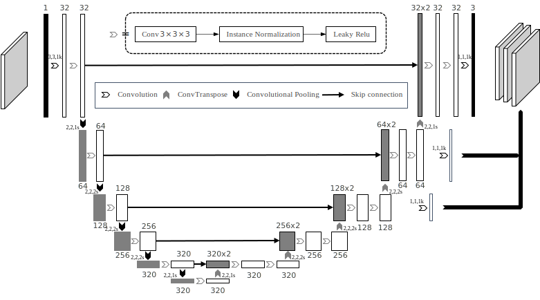

#

## Description

The main code is derived from old nnU-Net, with the primary goal of learning nn-Unet and detecting lesions in the pancreas as an example, while attempting to compress the model with TT-SVD.

## The network architecture

